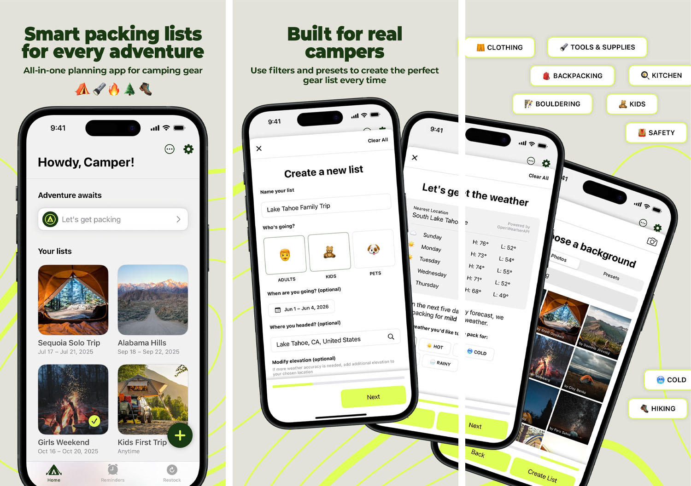
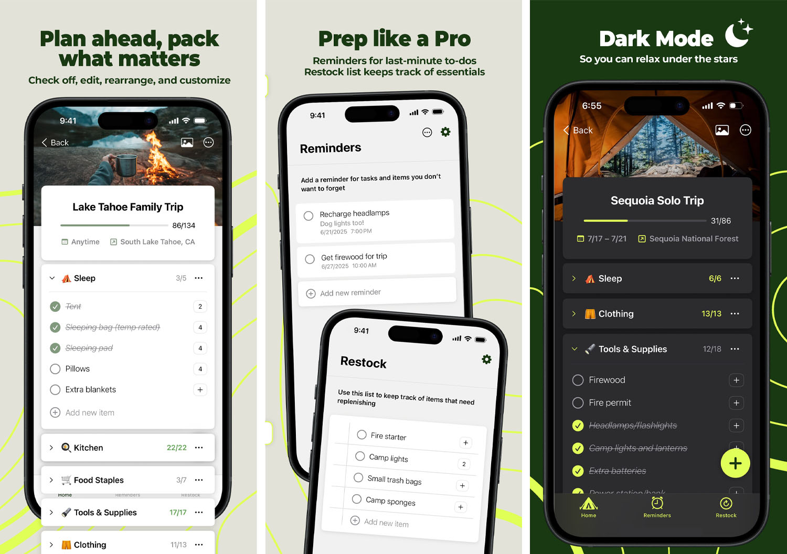

# 🏕️ CampingKit

**List. Plan. Pack. Camp.**

Your all-in-one checklist app for outdoor adventures.  
Pack smarter, stress less, and never forget the essentials again.

## Screenshots

---

## Features

### Smart Packing Lists for Every Adventure
From solo treks to family road trips, **CampingKit** adapts to your journey:

- 📝 Multiple packing lists
- ✅ Check-off, edit, rearrange, duplicate
- 📍 Save campsite location + easy navigation
- 📷 Custom photos and emojis

### Built for Real Campers
Designed by and for outdoor lovers:

- 🧠 Smart filters to create the perfect list every time
- 🌤️ Weather-based suggestions
- 🏕️ Nature-inspired presets

### Prep Like a Pro
Be ready for anything:

- 🧺 Restock tracker
- ⏰ Last-minute reminders
- 🔁 Sync across all devices
- 📴 Fully offline capable

### Outdoor-Friendly Design
Built for the backcountry and the basecamp:

- 🌙 Light & dark mode
- 🧭 Minimalist UI + delightful animations
- 🔋 Battery-efficient, low-data usage

---

## 🔓 Go Pro — Unlimited Adventures

Upgrade for $2.99 lifetime:

- 🌄 Custom app icons
- 📋 Unlimited lists
- 🔥 Emoji-powered bonfire celebration when list is complete

---

## Requirements

- **iOS** 18.2+
- **Built With:** SwiftUI, Swift 6, MVVM
- **iCloud Sync:** via `CloudKit`
- **In-App Purchases:** StoreKit 2
- **Animations & Haptics:** Polished, tactile user experience
- **APIs Used:** Weather API, Unsplash API

---

## Tech Stack

- `Swift 6` + `SwiftUI`
- MVVM architecture
- StoreKit 2 for in-app purchases
- Weather API integration
- Offline persistence & iCloud sync
- Delightful animations & native haptic feedback
- Optimized for performance and accessibility

---

## Planned Features

Coming soon: iCloud sharing so users can seamlessly collaborate on their lists.  
Stay tuned, fellow campers! 🏞️

---

## 📬 Feedback & Support

Have a feature idea, bug report, or campsite story? Reach out at [jess@junipercreative.co](mailto:jess@junipercreative.co)

---

🌲 Adventure awaits. Let’s pack it right.
